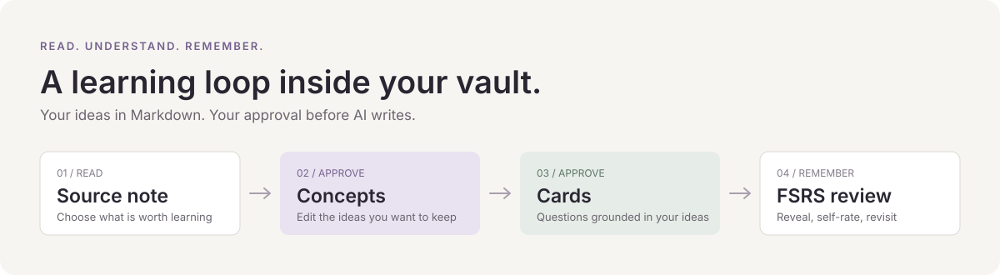

# Mneme

**把读过的知识，变成记得住的理解。**

Mneme 是一个以概念为中心的 Obsidian 学习插件。它把你的笔记转成可以编辑、确认的概念，再从确认后的概念生成卡片，用 FSRS 安排复习。知识正文保存在 Markdown 中。

[English](README.md) · [下载](https://github.com/HetongLin/mneme/releases/latest) · [反馈](https://github.com/HetongLin/mneme/issues/new/choose)

## 它能做什么

- **围绕概念学习**：一个概念对应一篇笔记，保留来源链接，并组织自己的卡片。
- **AI 提议，由你确认**：在 Inbox 中编辑、接受或拒绝，确认后才写入正式的知识文件。
- **支持直接写作**：自己创建概念和卡片，不需要 AI，也不需要人为增加审批步骤。
- **知识留在 Markdown 中**：概念文件和卡片组可直接查看、编辑。
- **本地 FSRS 复习**：显示问题、揭晓答案，再选择 Again / Hard / Good / Easy；日常复习不调用 AI。
- **无需 Key 即可体验**：手动创作与离线 Mock 示例无需账户；真实 AI 提取支持 OpenAI、Claude、Gemini、DeepSeek、Qwen、智谱、Moonshot、SiliconFlow 和自定义接口。

## 安装

当前通过 GitHub Releases 分发。1.0.0 已在 **macOS / Obsidian 1.13.7** 完成原生验收；manifest 声明最低版本为 1.5.0，Windows 和移动端尚未完成同等原生验收。

**BRAT 安装**：从 Obsidian 社区插件安装 [BRAT](https://github.com/TfTHacker/obsidian42-brat)，添加仓库 `HetongLin/mneme`，然后在社区插件中启用 Mneme。

**手动安装**：从 [最新 Release](https://github.com/HetongLin/mneme/releases/latest) 下载 `mneme-1.1.0.zip`，将其中的 `mneme` 文件夹放到 `<vault>/.obsidian/plugins/` 下，重载 Obsidian 后启用插件。使用自定义配置目录时，将 `.obsidian` 替换为你的配置目录。安装包包含 `main.js`、`manifest.json` 和 `styles.css`，无需编译。

## 第一次使用

1. 把 [Stable identity 示例](examples/Stable-identity.md) 复制到 Vault 并打开。
2. 在 Mneme 设置中打开 **Enable AI capture**，保留 **Provider → Mock**，即可离线体验。Mock 演示流程；真实语义提取需要配置远程 Provider。详见 [AI Provider 配置](docs/AI_PROVIDERS.md)。
3. 运行 **Mneme: Analyze Current Note**，再打开 **Mneme: Open Inbox**，编辑并接受概念提议。
4. 打开生成的概念，运行 **Mneme: Generate Cards from Current Concept**，在 Inbox 确认卡片。
5. 打开 **Mneme: Open Review View**，选择概念，点击 **Show Answer**，根据自己的回忆情况评分。

也可以通过 **Mneme: Create Concept / Create Card** 自己创作。产品界面目前为英文。生成的学习正文会遵循来源笔记的主要语言。

## 数据和隐私

概念与卡片正文保存在 Vault 的 Markdown 文件中。插件本地数据保存设置、提议、调度与复习记录；迁移 Vault 时保留它才能继续使用原有历史。

AI capture 默认关闭。主动使用远程 Provider 时，所选笔记或概念正文及请求上下文会发送到配置的接口。API Key 保存在 Obsidian 插件本地数据中，Mneme 不对其加密。详细范围见 [隐私说明](docs/PRIVACY.md)。

支持的 Provider、协议、默认接口地址和模型配置见 [AI Provider 配置](docs/AI_PROVIDERS.md)。

## 参与项目

欢迎提交可复现的 [问题反馈](https://github.com/HetongLin/mneme/issues/new/choose)、改善文档，或按照 [贡献指南](CONTRIBUTING.md) 提交 PR。公开方向见 [下一步优先事项](docs/PUBLIC_ROADMAP.md)。如果它对你的学习有帮助，欢迎 Star，让更多人发现这个项目。

使用 [MIT 许可证](LICENSE)，上游与依赖声明保留在 [第三方声明](THIRD_PARTY_NOTICES.md)。
